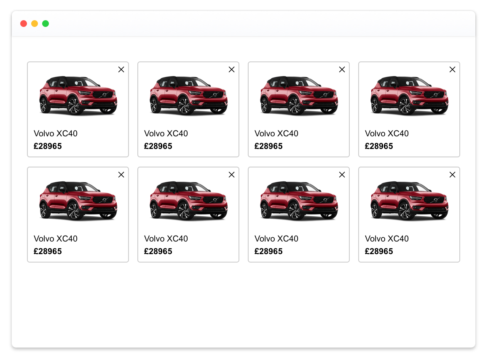
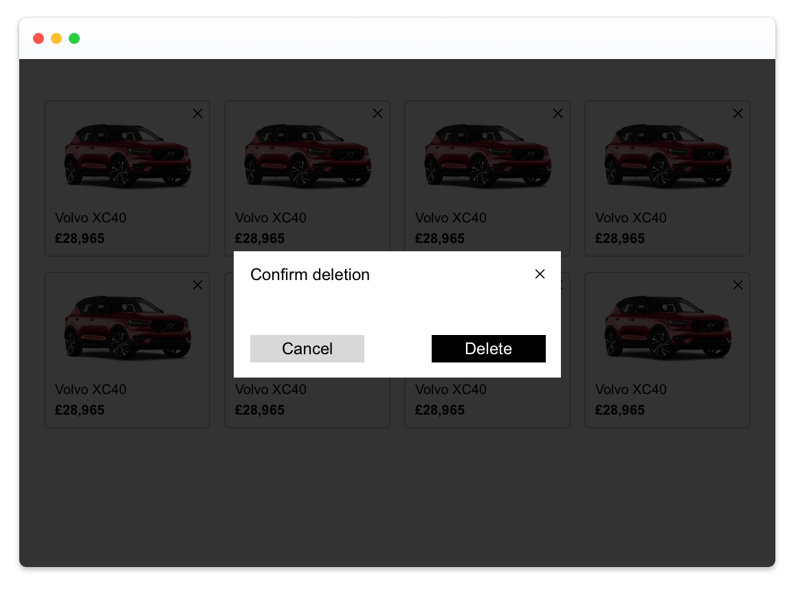

# Front-end tech test

You have been tasked to build a proof of concept for carwow. We would like to test a new page where we display a list of recommended cars for a custommer.
We have a JSON API and UI designs ready to help you.

This is the list of functionalities we would like, from most to least desirable:
- A customer can view 8 cars that carwow recommends, displayed in cards with their picture, name and price.
- On a mobile or tablet device, the cards are displayed in a single column.
- On a desktop computer (≥ 1024px), the cards are displayed in rows of 4 cards maximum.
- A customer can remove a card from the page if they dislike the car.
- Before a card is deleted, a modal opens to ask for confirmation. "Cancel" and "✕" close the modal. "Delete" close the modal and delete the card.

## Designs

Users can access a list of cars with their primary information. Items in the list can be clicked/tapped to access further details. You can decide which information is relevant to show on each screen.

## API

Use the following endpoint to display the list of cars: <https://boiling-chamber-77385.herokuapp.com/models>
