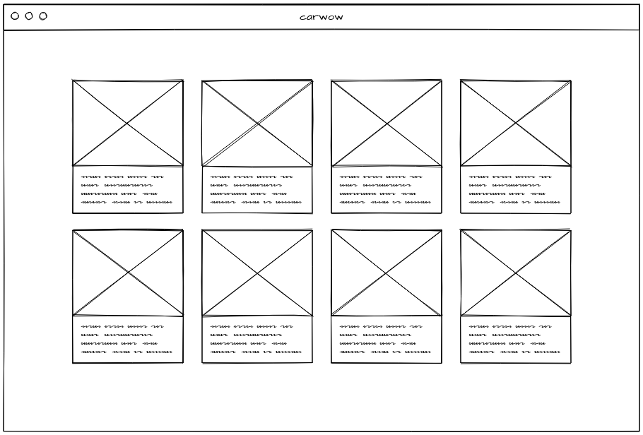
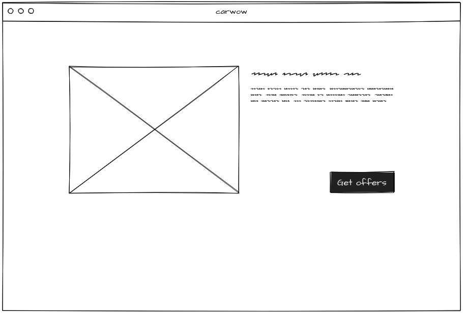

# Front-end tech test

carwow has decided to build a new interface for users to compare cars on its’ website.

Our design team came up with the early-stage wireframes below for this purpose.

Users can access a list of cars with their primary information. Items in the list can be clicked/tapped to access further details. You can decide which information is relevant to show on each screen.

There is no time limit for this test and we appreciate you taking the time to complete it. Sticking to the brief is perfectly fine for us, but if you wish to add any functionality or visual delight, go ahead!

## API

Use the following endpoints to display the cars' information:

- List of cars: <https://warm-dawn-92320.herokuapp.com/models>
- Details of a single car: <https://warm-dawn-92320.herokuapp.com/model/1> (replace 1 with the ID of the car)

## Tools and frameworks

- Use a solution of your choice, you may use a JS framework or vanilla JS if you wish
- You may use a CSS pre-processor, UI toolkit or anything that can help with styling, but simple and raw CSS is also fine
- Any library, tooling or compiled language can be used if it helps, but feel free to keep it simple

## Assessment

- Visually appealing
- Responsive UI
- Clean, readable and well structured code
- Semantic markup
- Anything in addition to the brief that brings value is a bonus

## Expectations

Please send us a link to your repository or an archive of your project.
If you can host your project on a free server (Github pages, Heroku, Netlify) for us to see it, that would be great. Likewise, send us instructions on how to run it locally and that will do too.
